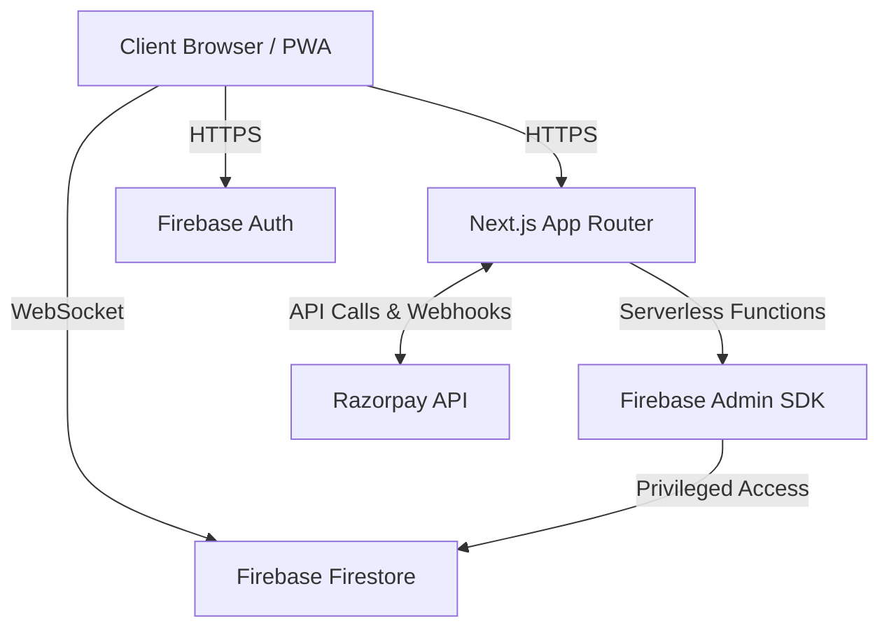

# Architecture

PlaySphere implements a decoupled, serverless architecture leveraging the Jamstack philosophy.

## Core Architecture Components

### 1. Client Layer (Browser / PWA)
- Responsible for rendering the UI, handling user interactions, and maintaining local state.
- Interfaces directly with Firebase Client SDKs for real-time data fetching (where rules permit).

### 2. Application Layer (Next.js Server / Vercel Edge)
- Handles Server-Side Rendering (SSR) for SEO-critical pages.
- Acts as an API Gateway for secure operations (Payments, Offline Bookings) via `/api/*` routes.

### 3. Data Layer (Firebase Firestore)
- Stores all persistent application data in scalable NoSQL document collections.
- Triggers real-time snapshot updates to subscribed clients.

### 4. Integration Layer
- Interfaces with external services like Razorpay via secure webhook endpoints and signed API requests.

## High-Level Architecture Diagram
