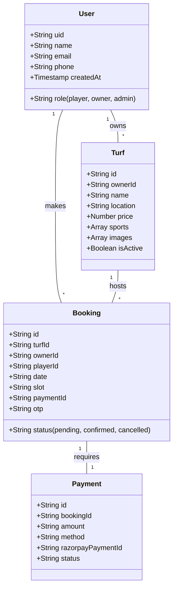

# Class Diagram

The following diagram represents the core data models and their relational references within the NoSQL schema.

```mermaid
classDiagram
    class User {
        +String uid
        +String role (player, owner, admin)
        +String name
        +String email
        +String phone
        +Timestamp createdAt
    }

    class Turf {
        +String id
        +String ownerId
        +String name
        +String location
        +Number price
        +Array sports
        +Array images
        +Boolean isActive
    }

    class Booking {
        +String id
        +String turfId
        +String ownerId
        +String playerId
        +String date
        +String slot
        +String status (pending, confirmed, cancelled)
        +String paymentId
        +String otp
    }

    class Payment {
        +String id
        +String bookingId
        +String amount
        +String method
        +String razorpayPaymentId
        +String status
    }

    User "1" -- "*" Turf : owns
    User "1" -- "*" Booking : makes
    Turf "1" -- "*" Booking : hosts
    Booking "1" -- "1" Payment : requires
```