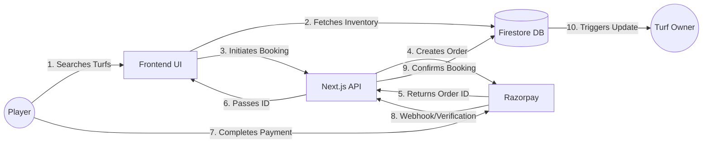

# Data Flow Diagram

The following diagram illustrates the primary data flow for the core booking and payment process.

## Level 1 Data Flow

```mermaid
graph LR
    Player((Player)) -->|1. Searches Turfs| UI[Frontend UI]
    UI -->|2. Fetches Inventory| DB[(Firestore DB)]
    UI -->|3. Initiates Booking| API[Next.js API]
    API -->|4. Creates Order| Gateway[Razorpay]
    Gateway -->|5. Returns Order ID| API
    API -->|6. Passes ID| UI
    Player -->|7. Completes Payment| Gateway
    Gateway -->|8. Webhook/Verification| API
    API -->|9. Confirms Booking| DB
    DB -->|10. Triggers Update| Owner((Turf Owner))
```