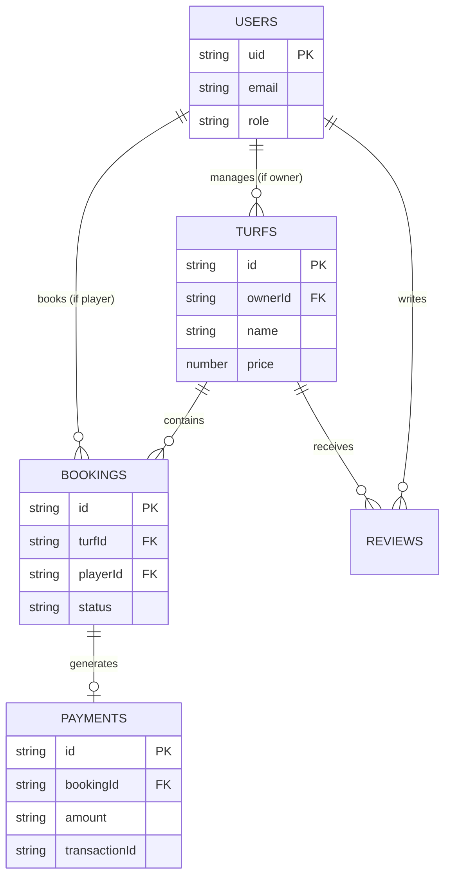

# ER Diagram

While Firestore is a NoSQL database, the logical entity relationships are modeled as follows to maintain data integrity.

```mermaid
erDiagram
    USERS ||--o{ TURFS : "manages (if owner)"
    USERS ||--o{ BOOKINGS : "books (if player)"
    TURFS ||--o{ BOOKINGS : "contains"
    BOOKINGS ||--o| PAYMENTS : "generates"
    TURFS ||--o{ REVIEWS : "receives"
    USERS ||--o{ REVIEWS : "writes"

    USERS {
        string uid PK
        string email
        string role
    }
    TURFS {
        string id PK
        string ownerId FK
        string name
        number price
    }
    BOOKINGS {
        string id PK
        string turfId FK
        string playerId FK
        string status
    }
    PAYMENTS {
        string id PK
        string bookingId FK
        string amount
        string transactionId
    }
```