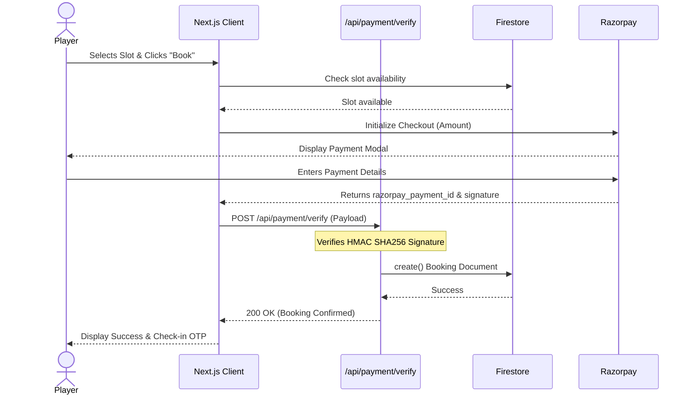

# Sequence Diagram

The following sequence diagram details the strict interaction flow for creating an online booking with payment verification.

```mermaid
sequenceDiagram
    actor Player
    participant UI as Next.js Client
    participant API as /api/payment/verify
    participant DB as Firestore
    participant Razorpay

    Player->>UI: Selects Slot & Clicks "Book"
    UI->>DB: Check slot availability
    DB-->>UI: Slot available
    UI->>Razorpay: Initialize Checkout (Amount)
    Razorpay-->>Player: Display Payment Modal
    Player->>Razorpay: Enters Payment Details
    Razorpay-->>UI: Returns razorpay_payment_id & signature
    UI->>API: POST /api/payment/verify (Payload)
    Note over API: Verifies HMAC SHA256 Signature
    API->>DB: create() Booking Document
    DB-->>API: Success
    API-->>UI: 200 OK (Booking Confirmed)
    UI-->>Player: Display Success & Check-in OTP
```