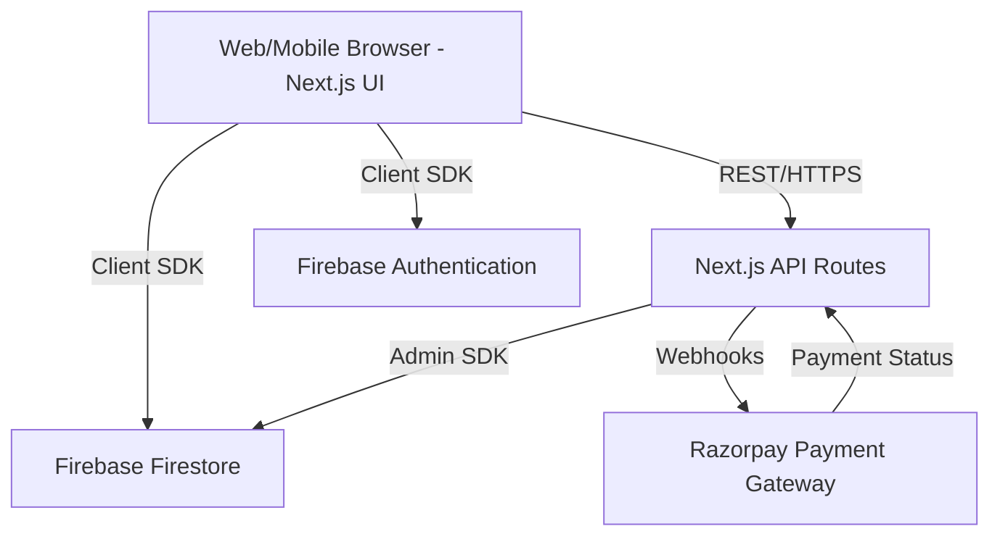

# 1. Project Overview

## 1.1 Project Name
**PlaySphere**

## 1.2 Tagline
*India's Smart Sports Turf Booking & Management Platform*

## 1.3 Vision
To revolutionize the amateur sports ecosystem in India by making sports venue accessibility seamless, while empowering venue owners with intelligent, automated management tools.

## 1.4 Mission
To bridge the gap between sports enthusiasts and facility owners through a robust, scalable, and intuitive digital platform that eliminates booking friction and maximizes turf utilization.

## 1.5 Problem Statement
- **For Players**: Finding available sports turfs is a manual, frustrating process involving phone calls, WhatsApp messages, and unconfirmed bookings. There is no central directory with real-time slot availability.
- **For Turf Owners**: Managing operations manually leads to double bookings, revenue leakage, missed payments, and zero analytics on business performance.

## 1.6 Solution
PlaySphere provides a centralized SaaS platform where:
- Players can search, view real-time availability, and book turfs instantly via secure online payments.
- Owners receive a comprehensive dashboard to digitize their inventory, handle online/offline bookings, and automatically reconcile settlements.

## 1.7 Objectives
- Digitize 1,000+ sports turfs within the first 12 months.
- Achieve a 99.9% booking success rate without race conditions.
- Process settlements to turf owners within T+1 days securely.

## 1.8 Key Features
- **Real-Time Inventory Management**: Deterministic slot locking to prevent double bookings.
- **Omnichannel Booking**: Handles both online customer bookings and offline walk-in bookings from owners.
- **Automated Financial Engine**: Calculates gross revenue, platform commissions, GST, and net owner payouts.
- **Progressive Web App (PWA)**: App-like experience installable directly from the browser.
- **Enterprise-Grade Admin Panel**: Fraud detection, revenue monitoring, and automated refund processing.

## 1.9 Target Users
1. **Players**: Sports enthusiasts looking to play football, cricket, badminton, etc.
2. **Turf Owners**: Small to medium sports facility businesses wanting to digitize their operations.
3. **Admins**: PlaySphere operational staff managing onboarding, fraud, and disputes.
4. **Super Admin**: Executive-level access for financial configuration (e.g., modifying platform fee percentages).

## 1.10 Business Model
PlaySphere operates on a **Commission-Based B2B2C Model**:
- **Players** pay the standard turf fee (or a slight convenience fee).
- **Turf Owners** pay a dynamic platform commission (e.g., 5-10%) on every successful booking processed through the platform.
- **Future Streams**: Premium turf placements, SaaS subscription for advanced analytics, and tournaments.

## 1.11 Tech Stack
- **Frontend**: Next.js 15, React, Tailwind CSS
- **Backend**: Next.js Serverless APIs, Firebase Auth
- **Database**: Firebase Firestore (NoSQL)
- **Payments**: Razorpay
- **Hosting**: Vercel

## 1.12 High-Level Architecture
PlaySphere utilizes a serverless architecture pattern for maximum scalability and low operational overhead.

## 1.13 Product Scope
PlaySphere is designed initially for the Indian market, integrating specific payment ecosystems (UPI via Razorpay). The scope covers the entire lifecycle of a turf booking: Discovery → Payment → Booking Confirmation → Facility Check-in → Owner Settlement.
