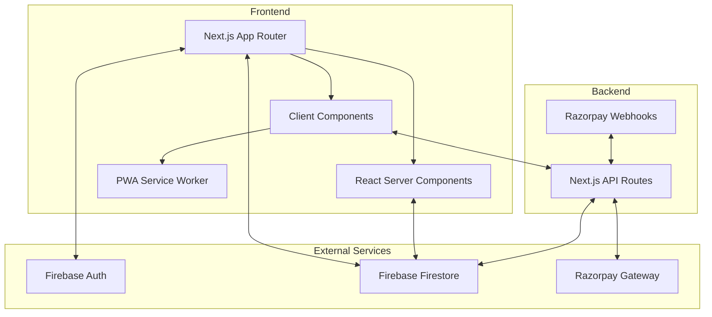
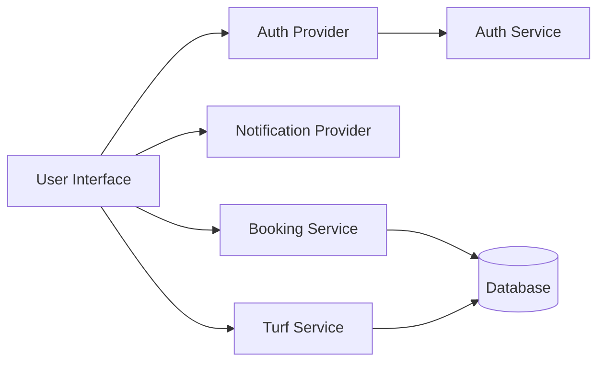
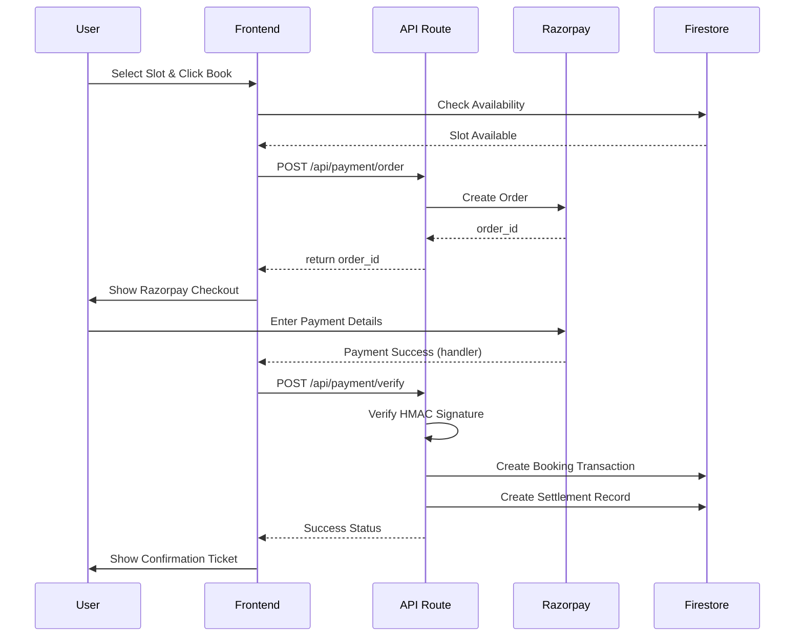

# 4. Software Design Document (SDD)

## 4.1 System Architecture

PlaySphere uses a decoupled, serverless architecture leveraging modern Edge and Serverless computing.

### 4.1.1 High-Level Architecture Diagram

---

## 4.2 Component Diagram

---

## 4.3 Sequence Diagram: Booking Flow

---

## 4.4 Design Patterns Used
1. **Service Repository Pattern**: All Firestore interactions are abstracted into `services/` (e.g., `turf.service.ts`, `booking.service.ts`). The UI never executes raw Firebase queries directly.
2. **Context API Pattern**: Global state for Authentication and Notifications is handled via React Context (`AuthContext.tsx`).
3. **Serverless Pattern**: Backend logic is broken down into stateless API routes (`app/api/*`).
4. **Idempotency Pattern**: Razorpay webhooks use a `webhook_events` collection to ensure a webhook processed twice due to network retries does not credit an account twice.

---

## 4.5 System Modules

### 4.5.1 Frontend (Presentation Layer)
Contains Next.js App Router pages. Separated into `(auth)`, `user`, `owner`, and `admin` route groups for layout isolation.

### 4.5.2 Service Layer
Acts as the intermediary between the Frontend and the Database Layer. Enforces data typing using TypeScript interfaces before sending payloads to Firestore.

### 4.5.3 Authentication Layer
Managed entirely by Firebase Auth. Tokens are verified on the client using `onAuthStateChanged`. For API routes, server-side validation is performed before executing sensitive mutations.
