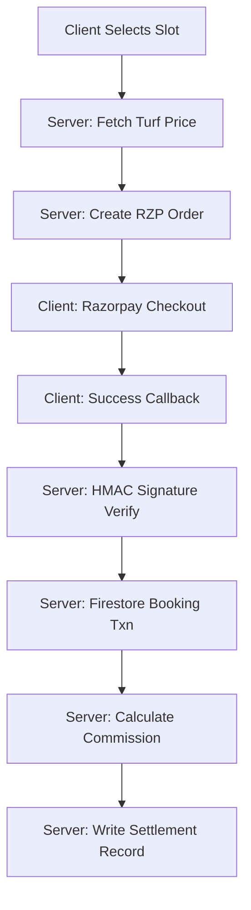

# 8. Payments & Settlement Architecture

PlaySphere processes payments using the Razorpay Node.js SDK and manages a complex B2B2C settlement ledger.

## 8.1 The Booking & Payment Flow

## 8.2 Commission Engine
The platform dynamically calculates commissions using the central `platformConfig` document.

**Example Calculation:**
- Turf Price: ₹1000
- Platform Commission (e.g., 5%): ₹50
- GST on Commission (18%): ₹9
- **Net Payout to Owner**: ₹941

These fields (`grossAmount`, `platformFee`, `taxAmount`, `netPayout`) are stored deterministically in the `settlements` collection for easy monthly reconciliation.

## 8.3 Webhooks
Webhooks act as a secondary safety net. If a user closes the browser during the Razorpay redirect, the `payment.captured` webhook ensures the booking is still processed.

## 8.4 Automated Refunds
When a user or admin cancels an eligible booking:
1. System calls `razorpay.payments.refund()`.
2. Updates `booking` status to `cancelled`.
3. Reverses the `settlement` record (`status: refunded`).
4. Generates an `audit_log` entry for security tracking.
